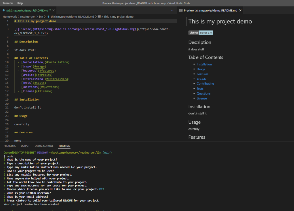

# Readme Generator

## Description

Allows a user to create a professional README from command line prompts

## Table of Contents
- [Preview](#preview)
- [Installation](#installation)
- [Usage](#usage)
- [Credits](#credits)
- [Questions](#questions)
- [License](#license)

## Preview

Screenshot

Demo

## Installation

    Must install nodejs and inquirer

## Usage

    Run readme-gen

## Credits

Inquirer documentation: https://www.npmjs.com/package/inquirer

## Questions

GitHub username: esbev

GitHub profile: https://github.com/esbev

Send any questions about the project to: esbev@hotmail.com

## License

